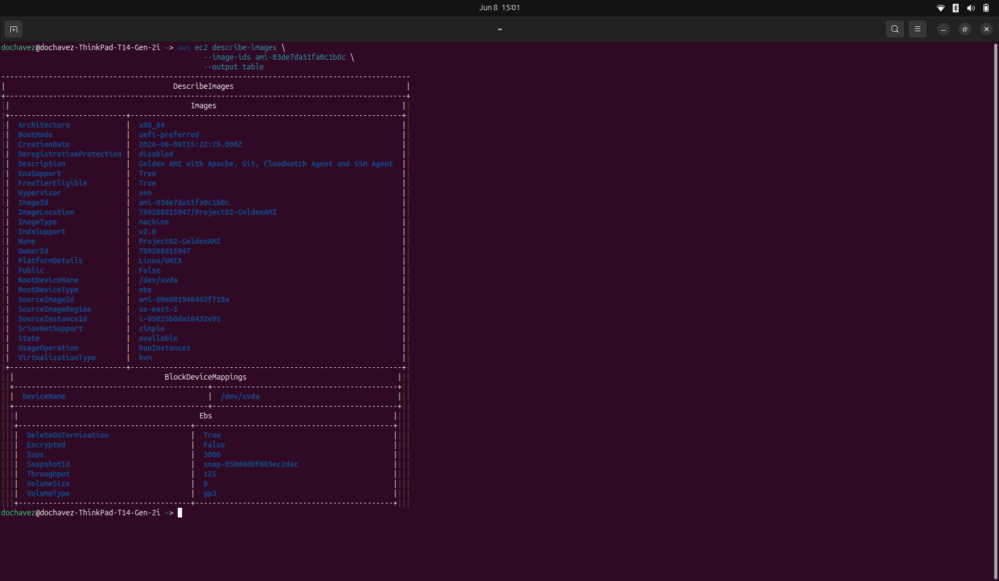
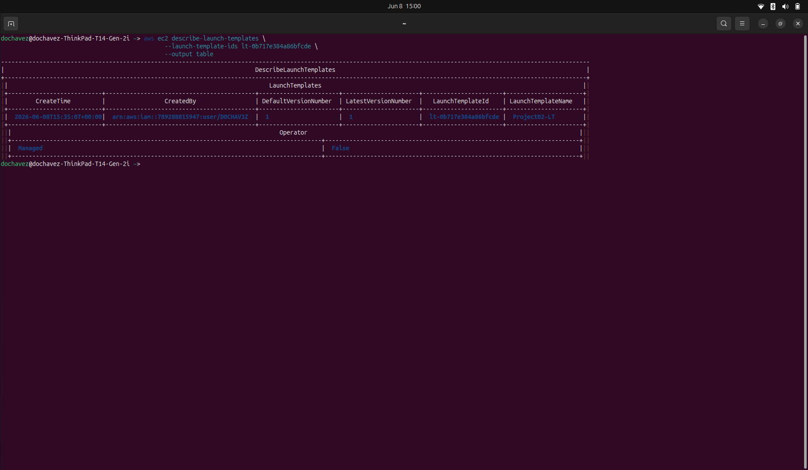
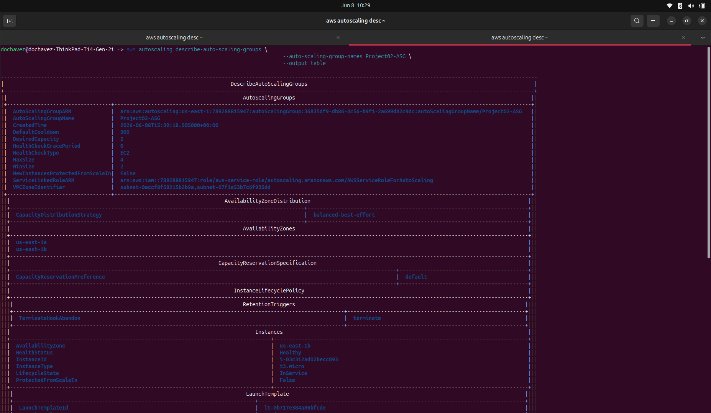
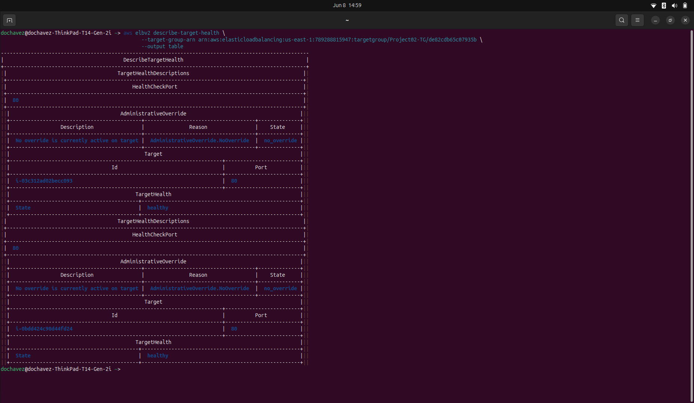
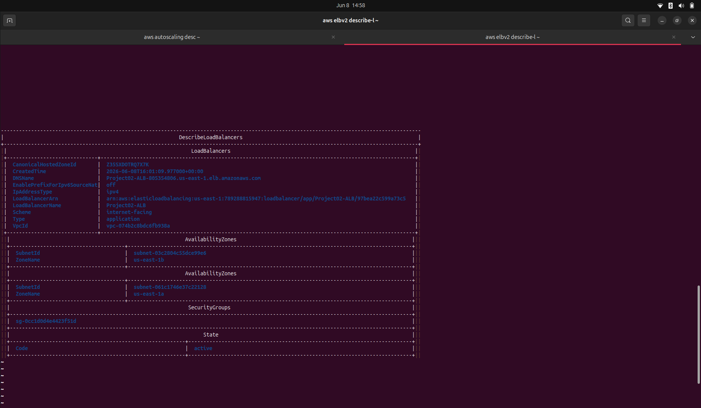
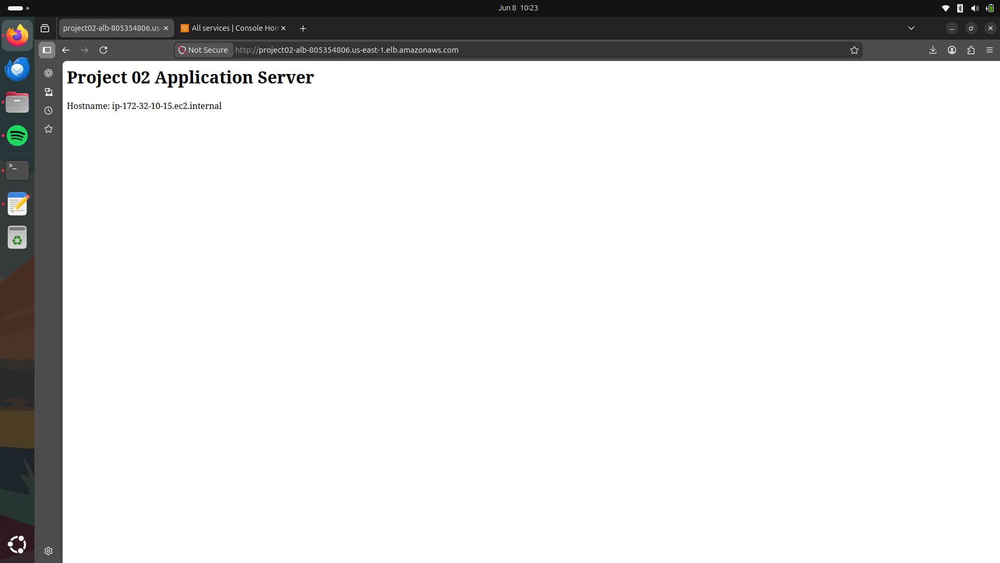

# AWS DevOps Project 02 - Highly Available and Auto Scalable Infrastructure

## Overview

This project demonstrates the deployment of a highly available and auto scalable AWS infrastructure using multiple AWS services including VPC, Transit Gateway, NAT Gateway, EC2, Auto Scaling Groups, Application Load Balancers, CloudWatch, and S3.

The environment was deployed and configured entirely through the AWS CLI, following an enterprise-style architecture that separates public and private resources across multiple Availability Zones.

> Original project inspiration and architecture design by: https://github.com/NotHarshhaa

---

## Architecture

The solution consists of two VPCs connected through a Transit Gateway:

### Primary VPC (192.168.0.0/16)

* Bastion Host
* Public Subnets
* Internet Gateway
* NAT Gateway
* CloudWatch Flow Logs

### Secondary VPC (172.32.0.0/16)

* Public Subnet A
* Public Subnet B
* Private Subnet A
* Private Subnet B
* Application Load Balancer
* Auto Scaling Group
* Launch Template
* Application Servers
* NAT Gateway
* CloudWatch Flow Logs

---

## Technologies Used

* Amazon VPC
* Amazon EC2
* Amazon Machine Images (AMI)
* Auto Scaling Groups
* Launch Templates
* Application Load Balancer (ALB)
* Target Groups
* Transit Gateway
* Internet Gateway
* NAT Gateway
* Amazon CloudWatch
* VPC Flow Logs
* Amazon S3
* AWS CLI
* Apache HTTP Server
* Git
* Amazon SSM Agent
* Amazon CloudWatch Agent

---

## Deployment Process

### Step 1 - VPC Deployment

Created two independent VPCs:

| VPC          | CIDR           |
| ------------ | -------------- |
| PrimaryVPC   | 192.168.0.0/16 |
| SecondaryVPC | 172.32.0.0/16  |

---

### Step 2 - Public and Private Subnets

Created multiple subnets across different Availability Zones.

#### Public Subnets

* PublicSubnetA
* PublicSubnetB

#### Private Subnets

* PrivateSubnetA
* PrivateSubnetB

This design ensures high availability and fault tolerance.

---

### Step 3 - Internet Connectivity

Configured:

* Internet Gateway
* Public Route Tables
* Public Subnet Associations

This allows public-facing resources such as the Bastion Host and Application Load Balancer to communicate with the Internet.

---

### Step 4 - NAT Gateway

Deployed NAT Gateway infrastructure to allow private resources to access the Internet for updates and package installations while remaining inaccessible from the public Internet.

---

### Step 5 - Transit Gateway

Configured a Transit Gateway and attached both VPCs.

This enables secure communication between:

* Primary VPC
* Secondary VPC

without exposing internal resources to the Internet.

---

### Step 6 - CloudWatch Monitoring

Configured:

* CloudWatch Log Groups
* CloudWatch Log Streams
* VPC Flow Logs

to capture and monitor network traffic across the environment.

---

### Step 7 - Bastion Host Deployment

Created:

* Bastion Security Group
* Bastion EC2 Instance
* Elastic IP Association

The Bastion Host acts as a secure jump server for administrative access.

---

### Step 8 - S3 Configuration Bucket

Created an S3 bucket to store application configuration files and future deployment artifacts.

---

### Step 9 - Golden AMI Creation

Customized an Amazon Linux 2023 instance with:

* Apache HTTP Server
* Git
* AWS CLI
* Amazon SSM Agent
* Amazon CloudWatch Agent

After validation, a custom Golden AMI was created and used as the standard image for future deployments.

---

### Step 10 - Launch Template

Created a Launch Template containing:

* Golden AMI
* Instance Type
* Security Groups
* Key Pair
* User Data Configuration

This ensures consistent and repeatable deployments.

---

### Step 11 - Auto Scaling Group

Configured an Auto Scaling Group with:

* Minimum Capacity: 2
* Desired Capacity: 2
* Maximum Capacity: 4

Instances are automatically distributed across multiple Availability Zones for resiliency.

---

### Step 12 - Target Group

Created an Application Target Group and configured health checks to validate backend application server availability.

---

### Step 13 - Application Load Balancer

Created an Internet-facing Application Load Balancer that distributes traffic across multiple EC2 instances.

Features:

* High Availability
* Health Monitoring
* Traffic Distribution
* Automatic Target Registration

---

## Validation Results

Successfully verified:

* VPC Connectivity
* Transit Gateway Routing
* NAT Gateway Functionality
* CloudWatch Logging
* Bastion Host Access
* Golden AMI Deployment
* Auto Scaling Group Health
* Target Group Health Checks
* Application Load Balancer Routing

Application successfully served through the Application Load Balancer endpoint.

---

## Project Outcome

Successfully deployed a production-style AWS environment featuring:

* Multi-VPC Architecture
* High Availability Design
* Auto Scaling
* Load Balancing
* Infrastructure Automation
* Centralized Logging
* Secure Administrative Access

This project demonstrates practical experience with AWS networking, compute, monitoring, and scalability services commonly used in modern cloud environments.

## Author

Darwin O. Chavez

AWS DevOps Portfolio Project

Infrastructure deployed, configured, tested, and documented using AWS CLI and AWS Management Console.

## Screenshots

### Golden AMI

### Launch Template

### Auto Scaling Group

### Target Group Health

### Application Load Balancer

### Working Application

## Learning Outcome

This project provided hands-on experience with building and operating a highly available AWS environment using industry-standard cloud infrastructure components. Through deployment and troubleshooting, I gained practical experience with networking, compute, monitoring, scaling, and load balancing services commonly used in production AWS environments.

